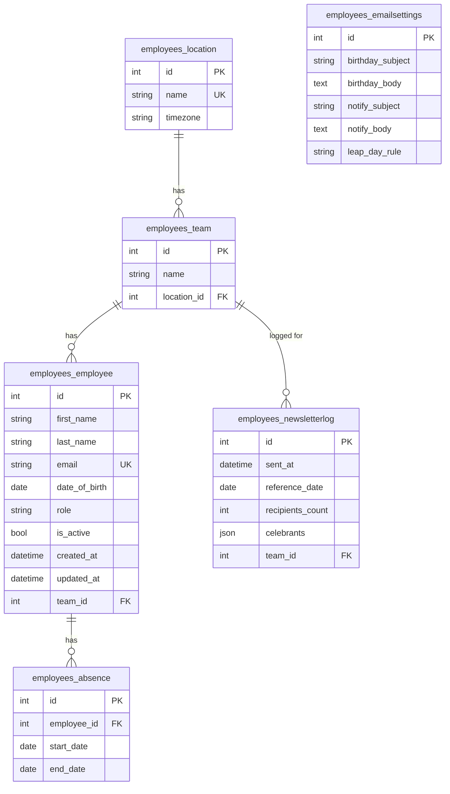

# Birthday Newsletter Service

API REST in Django + Django REST Framework per la gestione dei compleanni aziendali. Espone il CRUD su dipendenti, team e sedi, e genera due tipi di email: auguri al festeggiato e notifica ai colleghi del suo team.
L'invio è manuale — comando da terminale o endpoint REST, con data opzionale per simulare un giorno specifico — dato che lo scheduling automatico è fuori scope. Il backend email è quello di console: i messaggi vengono stampati a terminale anziché spediti, così non serve configurare SMTP.

## Decisioni di design

- **Regola del 29/02 configurabile**: chi nasce il 29 febbraio festeggia, negli
  anni non bisestili, il 28/02 o il 1/03 a seconda di `leap_day_rule` (default
  `FEB_28`). La regola e' un campo di `EmailSettings`, non e' hardcoded.
- **Logica testabile per data**: il rilevamento e l'invio accettano una data come
  parametro e non leggono mai l'orologio internamente. Cosi' ogni caso limite e'
  testabile passando una data fissa.
- **Notifiche per-team**: la notifica va ai colleghi del team del festeggiato,
  esclusi i festeggiati stessi, gli inattivi e chi e' in ferie quel giorno.
- **Il compleanno "buca" le ferie**: chi e' in ferie non riceve notifiche di
  lavoro, ma se e' il suo compleanno riceve comunque gli auguri.
- **Separazione delle responsabilità**: i manager dei modelli rispondono a "chi festeggia?" (query componibili e testabili), il servizio (`services.py`) orchestra il processo (auguri → notifiche → log), e view e comandi sono solo punti di ingresso che chiamano lo stesso servizio, senza duplicare logica.
- **Performance**: il servizio evita il problema N+1 con `select_related` sui
  festeggiati e precaricando assenze e membri dei team in poche query, invece di
  interrogare il database dentro i cicli.

## Requisiti

- Python 3.12+
- Django 6.0+, Django REST Framework (vedi `requirements.txt`)

<details> <summary>Avvio</summary>

```bash
# 1. Ambiente virtuale
python3 -m venv .venv
source .venv/bin/activate

# 2. Dipendenze
pip install -r requirements.txt

# 3. Database (SQLite, nessuna configurazione necessaria)
python manage.py migrate

# 4. Dati di esempio (sedi, team, dipendenti, assenze, configurazione)
python manage.py seed_demo_data --flush

# 5. Avvio del server
python manage.py runserver
```


L'API e' disponibile su `http://127.0.0.1:8000/api/`.

</details>

<details> <summary>Schema del database</summary>


</details>

<details> <summary>Modello di dati</summary>

Sei tabelle, su tre blocchi logici:

- **Anagrafica**: `Location` (sede, con timezone), `Team` (legato a una sede,
  con vincolo di unicita' nome+sede), `Employee` (dipendente: ruolo, flag attivo,
  data di nascita).
- **Assenze**: `Absence` (periodo con data inizio/fine, legato a un dipendente).
  Tabella separata perche' un dipendente puo' avere piu' assenze nel tempo.
- **Servizio**: `NewsletterLog` (storico degli invii, con snapshot JSON dei
  festeggiati) e `EmailSettings` (configurazione singleton: template email e
  regola del 29/02).

Le relazioni usano tre comportamenti `on_delete` diversi, scelti di proposito:

- **PROTECT** (`location -> team`, `team -> employee`): non si puo' cancellare
  una sede o un team finche' esistono record collegati. Protegge i dati anagrafici.
- **CASCADE** (`employee -> absence`): cancellando un dipendente spariscono le sue
  assenze, che gli appartengono.
- **SET_NULL** (`team -> newsletter_log`): cancellando un team lo storico degli
  invii resta, ma il riferimento diventa nullo. Preserva l'audit trail.

</details>

## API

Endpoint principali (contattabili da Postman, curl, o l'interfaccia navigabile DRF):

| Metodo | URL | Descrizione |
|--------|-----|-------------|
| GET/POST | `/api/employees/` | Lista e creazione dipendenti |
| GET/PUT/PATCH/DELETE | `/api/employees/{id}/` | Dettaglio, modifica, eliminazione |
| GET | `/api/employees/celebrating_today/?date=YYYY-MM-DD` | Chi festeggia (default: oggi) |
| GET/POST | `/api/teams/`, `/api/locations/`, `/api/absences/` | CRUD su team, sedi, assenze |
| GET | `/api/newsletter-logs/` | Storico invii (sola lettura) |
| GET/PUT | `/api/settings/` | Configurazione (template, regola 29/02) |
| POST | `/api/newsletter/trigger/` | Lancia l'invio (body opzionale: data) |


<details> <summary>Esempi (curl)</summary>

```bash
# Chi festeggia il 28/02/2025 (anno non bisestile)
# -> include anche i nati il 29/02, per la regola configurata
curl "http://127.0.0.1:8000/api/employees/celebrating_today/?date=2025-02-28"

# Lancia la newsletter per una data specifica
curl -X POST http://127.0.0.1:8000/api/newsletter/trigger/ \
     -H "Content-Type: application/json" \
     -d '{"date": "2025-02-28"}'

# Cambia la regola del 29/02
curl -X PUT http://127.0.0.1:8000/api/settings/ \
     -H "Content-Type: application/json" \
     -d '{"leap_day_rule": "MAR_01"}'
```

In alternativa, da terminale:

```bash
python manage.py send_birthday_newsletter --date 2025-02-28
```
</details>


## Test

```bash
python manage.py test employees
```

24 test che coprono i casi limite del rilevamento (29/02 in anno bisestile e non,
con entrambe le regole; esclusione degli inattivi), la logica di invio (festeggiato
escluso dalla notifica, colleghi in ferie esclusi, festeggiato in ferie che riceve
comunque gli auguri) e gli endpoint REST.


