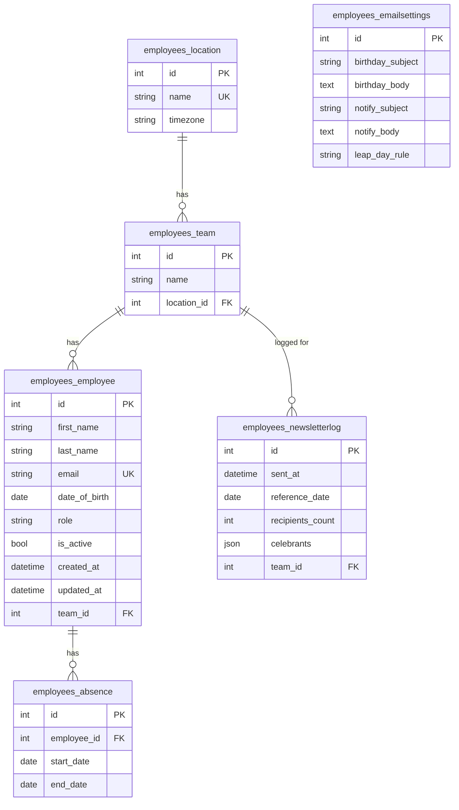

# Birthday Newsletter Service

## Database schema

```mermaid
erDiagram
  employees_location ||--o{ employees_team : "has"
  employees_team ||--o{ employees_employee : "has"
  employees_employee ||--o{ employees_absence : "has"
  employees_team ||--o{ employees_newsletterlog : "logged for"
  employees_location {
    int id PK
    string name UK
    string timezone
  }
  employees_team {
    int id PK
    string name
    int location_id FK
  }
  employees_employee {
    int id PK
    string first_name
    string last_name
    string email UK
    date date_of_birth
    string role
    bool is_active
    datetime created_at
    datetime updated_at
    int team_id FK
  }
  employees_absence {
    int id PK
    int employee_id FK
    date start_date
    date end_date
  }
  employees_newsletterlog {
    int id PK
    datetime sent_at
    date reference_date
    int recipients_count
    json celebrants
    int team_id FK
  }
  employees_emailsettings {
    int id PK
    string birthday_subject
    text birthday_body
    string notify_subject
    text notify_body
    string leap_day_rule
  }
```
